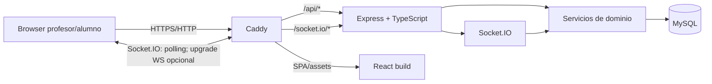

# Arquitectura técnica

## 1. Objetivos arquitectónicos

La arquitectura debe optimizar:
1. fiabilidad de la lógica competitiva;
2. funcionamiento detrás de proxies/bastiones donde WebSocket puede no estar disponible;
3. simplicidad operativa mediante Docker Compose;
4. mantenibilidad;
5. experiencia en tiempo real razonable para un aula de decenas de participantes.

Principio central: **el servidor es autoritativo**. El navegador representa el estado; no decide resultados.

## 2. Topología



Caddy es el punto público. MySQL no debe exponerse fuera de la red Docker salvo necesidad de desarrollo explícita.

## 3. Estructura recomendada

```text
/
├── AGENTS.md
├── README.md
├── docs/
│   ├── product-spec.md
│   └── architecture.md
├── backend/
│   ├── src/
│   │   ├── config/
│   │   ├── controllers/
│   │   ├── middleware/
│   │   ├── models/
│   │   ├── routes/
│   │   ├── services/
│   │   ├── sockets/
│   │   ├── validators/
│   │   ├── utils/
│   │   ├── types/
│   │   └── app.ts
│   ├── migrations/
│   ├── seeders/
│   ├── tests/
│   └── Dockerfile
├── frontend/
│   ├── src/
│   │   ├── components/
│   │   ├── pages/
│   │   ├── hooks/
│   │   ├── contexts/
│   │   ├── services/
│   │   ├── types/
│   │   └── utils/
│   └── Dockerfile
├── caddy/
│   └── Caddyfile
├── docker-compose.yml
└── .env.example
```

Puede ajustarse sin romper la separación de responsabilidades.

## 4. Modelo de datos

### Teacher
- `role` ENUM `teacher|admin`, por defecto `teacher`.
- `isActive` BOOLEAN: registros nuevos inactivos; profesores previos activos.
- `sessionVersion`: incrementado al cambiar activación/borrar, validado contra JWT.
- `deletedAt`: borrado lógico con anonimización de nombre/email/hash para conservar FKs de partidas.
- `id`
- `name`
- `email` UNIQUE
- `passwordHash`
- timestamps

### Game
- `showPartnerOption` BOOLEAN NOT NULL DEFAULT true, añadido por `202609140001-partner-option-visibility.cjs`. Se valida como booleano al crear la partida. Cuando es false, el snapshot personalizado devuelve `null` en la opción ajena incluso después del cierre (ambas para espectadores); el profesor recibe ambos textos. HTTP y Socket.IO usan el mismo snapshot, también en reconexiones.
- `id`
- `teacherId` FK
- `code`
- `status`
- `questionCount`
- `questionDurationSeconds`
- `currentQuestionIndex`
- `questionStartedAt` nullable
- `questionExpiresAt` nullable
- `startedAt` nullable
- `finishedAt` nullable
- timestamps

Índice único sobre código para las partidas que deban evitar colisión; si MySQL/Sequelize complica un índice único parcial, usar código globalmente único o estrategia equivalente simple.

### Player
Identidad temporal:
- `id`
- `gameId` FK
- `name`
- `avatar`
- `sessionTokenHash` o identificador seguro equivalente
- `connectionStatus`
- `lastSeenAt`
- timestamps

No persistir `socket.id` como identidad principal.

### Team
- `id`
- `gameId` FK
- `name`
- `leftPlayerId` FK UNIQUE según modelo
- `rightPlayerId` FK UNIQUE según modelo
- timestamps

Validar además que ambos jugadores pertenecen al mismo `gameId`.

### Question
- `isActive` BOOLEAN NOT NULL DEFAULT true, añadido mediante migración `202609120004-question-activation.cjs`.
- `id`
- `statement`
- `leftOption`
- `rightOption`
- `correctOption` ENUM `LEFT|RIGHT`
- `explanation`
- `category`
- `difficulty`
- timestamps si se desea.

### GameQuestion
Congela selección/orden:
- `id`
- `gameId` FK
- `questionId` FK
- `position`
- UNIQUE `(gameId, position)`
- UNIQUE `(gameId, questionId)` si no se repiten preguntas.

### TeamAnswer
- `id`
- `gameId` FK
- `gameQuestionId` FK
- `teamId` FK
- `answeredByPlayerId` FK
- `selectedOption`
- `isCorrect`
- `responseTimeMs`
- `scoreAwarded`
- `answeredAt`
- timestamps

Restricción crítica:
- UNIQUE `(teamId, gameQuestionId)`.

No aceptar valores de `isCorrect`, `responseTimeMs` o `scoreAwarded` calculados por cliente.

### PairRequest (opcional pero recomendado)
Para modelar solicitudes sin depender solo de memoria:
- `id`
- `gameId`
- `requesterPlayerId`
- `targetPlayerId`
- `targetRelativePosition` (`LEFT|RIGHT`)
- `status` (`PENDING|ACCEPTED|REJECTED|CANCELLED|EXPIRED`)
- timestamps.

Puede sustituirse por estado efímero si se garantiza correctamente la consistencia; para despliegues de una sola instancia backend es aceptable, pero la creación final del equipo siempre debe validarse/transaccionarse en DB.

## 5. Relaciones

- Teacher 1:N Game
- Game 1:N Player
- Game 1:N Team
- Game 1:N GameQuestion
- Question 1:N GameQuestion
- GameQuestion 1:N TeamAnswer
- Team 1:N TeamAnswer
- Player 1:N TeamAnswer como `answeredBy`

Las relaciones Team↔Player expresan roles izquierdo/derecho.

## 6. Autenticación

La administración usa el mismo JWT de cuenta y consulta en MySQL el rol y la activación, sin confiar en roles enviados por clientes. `GET /api/admin/teachers` lista únicamente profesores no borrados con búsqueda y paginación de 25; `PUT /api/admin/teachers/:id` acepta solo `{isActive:boolean}`; `DELETE` anonimiza y desactiva. Las mutaciones bloquean la cuenta objetivo en una transacción y rechazan administradores. Una notificación interna tras commit desconecta sus sockets; cada comando y publicación Socket.IO vuelve a validar la cuenta y la versión del JWT.

`ensureAdministrator` crea la cuenta inicial desde variables de entorno validadas, con bcrypt, después de migraciones. No existe registro administrativo público ni contraseña por defecto. La migración `202609120003-teacher-administration.cjs` preserva acceso de profesores previos y exige aprobación para nuevos registros.

### Profesor
REST:
- `POST /api/auth/register`
- `POST /api/auth/login`
- `GET /api/auth/me`

JWT firmado con secreto de entorno. Middleware valida token y carga identidad. Toda mutación de una partida comprueba `game.teacherId === authenticatedTeacher.id`.

### Alumno
Al entrar se genera un token aleatorio criptográficamente fuerte. Preferir almacenar en DB un hash si es práctico. El navegador conserva el token (localStorage o sessionStorage según decisión documentada). Socket.IO y REST de jugador lo presentan para recuperar identidad.

No usar JWT de profesor para alumnos.

## 7. REST frente a Socket.IO

REST para operaciones transaccionales/no interactivas y bootstrap:
- auth;
- crear/consultar partidas del profesor;
- comprobar/entrar por código si se decide hacerlo REST;
- health;
- carga inicial.

Socket.IO para eventos interactivos:
- lobby;
- solicitudes de pareja;
- cambios de equipo;
- inicio de pregunta;
- respuesta;
- cierre;
- rankings/estado.

Evitar dos implementaciones independientes de la misma regla: REST y sockets deben llamar a los mismos servicios de dominio.

## 8. Eventos Socket.IO

Nombres orientativos:

Cliente → servidor:
- `game:join`
- `game:resume`
- `team:request`
- `team:respond`
- `team:set-name`
- `game:start`
- `question:start`
- `answer:submit`
- `ranking:set-view`

Servidor → cliente:
- `game:state`
- `lobby:updated`
- `team:request-received`
- `team:created`
- `team:updated`
- `game:started`
- `question:started`
- `answer:accepted`
- `answer:rejected`
- `question:finished`
- `ranking:updated`
- `game:finished`
- `connection:diagnostic`

Definir tipos TypeScript de payloads compartidos si el monorepo lo permite sin acoplamiento incómodo. Validar payloads en servidor con Zod.

## 9. Rooms

Usar rooms para limitar broadcasts:
- `game:{gameId}`
- `teacher:{teacherId}` o `teacher-game:{gameId}`
- `team:{teamId}`
- `player:{playerId}`

Nunca emitir globalmente datos de una partida.

## 10. Socket.IO y bastión

Configuración conceptual servidor:

```ts
new Server(httpServer, {
  path: "/socket.io",
  transports: ["polling", "websocket"],
});
```

Cliente:

```ts
io({
  path: "/socket.io",
  transports: ["polling", "websocket"],
});
```

No forzar `websocket`. Permitir upgrade cuando funcione.

Caddy debe hacer reverse proxy de `/socket.io/*` al backend. Caddy soporta el upgrade WebSocket, pero la aplicación debe funcionar aunque un proxy anterior lo bloquee.

Evitar sticky sessions como requisito inicial manteniendo una sola instancia de backend. Si en el futuro se escala horizontalmente, documentar la necesidad de un adapter compartido (por ejemplo Redis) y afinidad/estrategia compatible con polling.

## 11. Diagnóstico

`GET /api/health`:
- devuelve estado HTTP;
- verifica DB con una consulta ligera.

Ejemplo:

```json
{
  "status": "ok",
  "database": "ok"
}
```

En profesor, mostrar transporte efectivo consultando `socket.io.engine.transport.name` y actualizar tras `upgrade`.

## 12. Flujo de creación de partida

`POST /api/games` acepta `difficulty` opcional (texto de hasta 120 caracteres): omitirlo selecciona todos los niveles y una cadena vacía selecciona preguntas sin nivel. El servidor filtra por dificultad antes de sortear y comprueba disponibilidad dentro de la transacción. `GET /api/questions` incluye `difficulties` con recuentos globales de preguntas activas no borradas por nivel, independientes de la búsqueda y paginación. La selección queda congelada en `GameQuestion`, incluida la dificultad en su snapshot; no requiere cambios de esquema.

La selección excluye preguntas borradas y desactivadas (`deletedAt IS NULL AND isActive = true`). `PUT /api/questions/:id/activation` requiere profesor activo y `{version, isActive}` validado con Zod; bloquea la fila y aumenta la versión, compartida con edición y borrado. El listado conserva preguntas activas/desactivadas y devuelve `activeTotal` global para configurar partidas. El cambio de activación no modifica los snapshots `GameQuestion` existentes.

Transacción/servicio:
1. validar configuración;
2. generar código;
3. seleccionar preguntas;
4. crear Game;
5. crear GameQuestions ordenadas;
6. devolver partida.

No seleccionar nuevas preguntas al recargar: `GameQuestion` congela la partida.

## 13. Formación de pareja

Servicio autoritativo:
1. autenticar ambos jugadores;
2. comprobar mismo juego;
3. comprobar estado LOBBY/READY permitido;
4. comprobar que ninguno pertenece ya a equipo;
5. traducir orientación física a `leftPlayerId/rightPlayerId`;
6. crear Team en transacción;
7. manejar carrera si otro proceso emparejó a alguno;
8. emitir estado actualizado.

Conviene reforzar con restricciones/índices que impidan que un Player ocupe varios equipos. Si la estructura con dos FKs dificulta una restricción transversal en MySQL, considerar tabla `TeamMember(teamId, playerId UNIQUE, side)` manteniendo exactamente dos miembros y `side UNIQUE por team`; es una alternativa arquitectónica válida y más normalizada.

## 14. Máquina de estados

Transiciones orientativas:

```text
LOBBY -> READY
READY -> QUESTION_ACTIVE
QUESTION_ACTIVE -> QUESTION_FINISHED
QUESTION_FINISHED -> SHOWING_RANKING
SHOWING_RANKING -> QUESTION_ACTIVE   (si quedan preguntas)
SHOWING_RANKING -> FINISHED          (última pregunta)
```

`LOBBY` y `READY` pueden alternar mientras entran/se forman equipos si la implementación usa READY como estado derivado; no permitir que esta simplificación debilite las validaciones.

Cada comando comprueba estado permitido antes de mutar.

## 15. Inicio y expiración de pregunta

Al iniciar:
- usar hora de servidor;
- persistir `questionStartedAt`;
- calcular/persistir `questionExpiresAt`;
- cambiar estado a `QUESTION_ACTIVE`;
- emitir pregunta sin `correctOption`.

No ejecutar un `UPDATE` por segundo.

Para cierre, combinar:
- timer en proceso para UX inmediata en instancia única;
- comprobación autoritativa de `expiresAt` en cada respuesta;
- recuperación al reiniciar/reconectar leyendo timestamps.

El timer en memoria nunca sustituye al timestamp persistido.

## 16. Envío de respuesta y carrera

Payload mínimo del cliente: intención de responder. El servidor deduce:
- jugador autenticado;
- equipo;
- side/rol;
- GameQuestion activa.

No permitir que el cliente elija arbitrariamente `teamId`, puntos ni corrección.

Algoritmo:
1. obtener hora servidor;
2. validar `QUESTION_ACTIVE`;
3. validar `receivedAt <= expiresAt`;
4. resolver equipo/rol del jugador;
5. intentar crear `TeamAnswer`;
6. la UNIQUE `(teamId, gameQuestionId)` decide la carrera;
7. si conflicto: devolver `already_answered`;
8. si inserta: calcular corrección y puntuación en servidor;
9. confirmar transacción;
10. emitir resultado al equipo y actualizar contadores.

Para evitar insertar valores derivados inconsistentes, calcularlos antes del INSERT dentro de la operación/transacción, pero siempre desde datos del servidor.

## 17. Puntuación

Servicio puro:

```text
incorrecta -> 0
correcta -> 1000 + bonus [0..500]
bonus = round(500 * remainingMs / durationMs)
```

Clampear valores. Testear bordes:
- respuesta instantánea;
- justo al límite;
- incorrecta;
- tiempo negativo/fuera de rango.

## 18. Ranking

No aceptar ranking del cliente. Calcular mediante consultas/servicio.

Equipo:
- suma `scoreAwarded`;
- count correctas;
- tiempos correctos para desempate.

La clasificación individual está desactivada. `Game.rankingView` guarda `hidden` (por defecto) o `teams`. El comando autorizado `ranking:set-view` modifica esta preferencia sin cambiar la fase. `QUESTION_FINISHED` permite pasar directamente a `QUESTION_ACTIVE` o `FINISHED`. El frontend muestra el ranking habilitado junto a los resultados; el podio final siempre está disponible.

Individual (referencia histórica, sin cálculo ni publicación):
- suma de `scoreAwarded` de TeamAnswers donde `answeredByPlayerId = player.id`;
- respuestas lanzadas;
- aciertos ejecutados.

Comentarios se calculan después a partir de estadísticas y plantillas locales.

## 19. Reconexión

En `connect`/`game:resume`:
1. validar token temporal;
2. localizar Player;
3. marcar conectado/actualizar `lastSeenAt`;
4. unir rooms;
5. devolver snapshot autoritativo.

Snapshot puede incluir:
- Game seguro;
- Player;
- Team/rol;
- lobby permitido;
- pregunta activa sin solución;
- `startedAt`/`expiresAt`;
- si el equipo ya respondió, estado correspondiente.

Al desconectar, no eliminar Player. Marcar desconectado con tolerancia razonable.

## 20. Frontend

Rutas orientativas:
- `/`
- `/teacher/login`
- `/teacher/register`
- `/teacher`
- `/teacher/games/:id`
- `/join`
- `/play/:gameCode`

Separar pantallas/estados:
- Home;
- TeacherAuth;
- TeacherDashboard;
- TeacherLobby;
- TeacherQuestion;
- TeacherResults/Ranking;
- JoinGame;
- AvatarSetup;
- PlayerLobby;
- Pairing;
- PlayerQuestion;
- PlayerFeedback;
- Final.

Mantener un contexto/store ligero para sesión y socket; evitar duplicar el estado autoritativo innecesariamente.

## 21. ENTER

Registrar un listener estable. Ignorar:
- `event.repeat`;
- cuando target es input/textarea/select/contenteditable;
- si pregunta no activa;
- si envío local ya está pendiente/aceptado.

Tras primer envío, bloquear UX hasta respuesta del servidor. Ante rechazo recuperable, sincronizar snapshot. El backend sigue siendo la garantía real.

## 22. Caddy y SPA

Objetivo:
- `/api/*` → backend;
- `/socket.io/*` → backend;
- resto → assets React;
- fallback de rutas React a `index.html`.

El build final de React no debe servirse con Vite dev server en producción.

## 23. Docker Compose

Servicios mínimos:
- `mysql`;
- `backend`;
- `frontend` como build/servidor según diseño;
- `caddy`.

Puede usarse un volumen compartido/build stage para que Caddy sirva los assets, siempre que el compose final sea sencillo.

Incluir:
- volumen persistente MySQL;
- healthcheck MySQL;
- backend esperando DB;
- red interna;
- variables desde `.env`;
- Caddy como puerto público.

No exponer MySQL por defecto.

## 24. Migraciones y seeds

Scripts esperados:
- `npm run db:migrate`
- `npm run db:seed`
- `npm run db:reset` si se implementa de forma segura para desarrollo.

El arranque debe esperar a MySQL. Documentar si las migraciones se ejecutan automáticamente en entrypoint o mediante comando explícito. Evitar carreras entre varias instancias.

Seeder: exactamente 20 preguntas iniciales, con `up` y `down` razonables e idempotencia controlada.

El seeder adicional `202609130001-easy-questions.cjs` incorpora 20 preguntas de dificultad baja sin modificar el original. Omite IDs para que MySQL los asigne sin colisionar con preguntas creadas por profesores. Sequelize registra cada seeder ejecutado; el banco incluido suma 40 preguntas.

## 25. Seguridad

- bcrypt para passwords;
- JWT con secreto de entorno;
- Zod;
- Helmet;
- rate limit en auth;
- límites de longitud;
- no loggear secretos/tokens;
- no revelar respuesta correcta durante pregunta;
- comprobar autorización de profesor;
- comprobar pertenencia de jugador/equipo;
- no confiar en IDs arbitrarios;
- CORS restringido cuando aplique.

## 26. Variables de entorno

`.env.example` orientativo:

```env
MYSQL_DATABASE=pair_game
MYSQL_USER=pair_game
MYSQL_PASSWORD=change_me
MYSQL_ROOT_PASSWORD=change_root_me

JWT_SECRET=change_this_secret
JWT_EXPIRES_IN=8h

NODE_ENV=production
PORT=3000
```

Añadir las necesarias sin secretos reales.

## 27. Observabilidad mínima

Logs estructurados o coherentes para:
- arranque;
- conexión DB;
- errores HTTP;
- conexión/desconexión Socket.IO;
- transporte efectivo en desarrollo;
- cambios críticos de estado.

No registrar passwords, JWT ni tokens de jugador.

## 28. Tests

Unitarios:
- score;
- comentarios;
- códigos;
- máquina de estados.

Integración:
- auth/autorización;
- creación de partida;
- formación de equipos;
- timeout;
- respuesta única concurrente.

La prueba de concurrencia debe lanzar dos intentos de respuesta para el mismo `(team, gameQuestion)` y comprobar que solo existe un `TeamAnswer`.

## 29. Decisiones para una primera versión

Mantener una sola instancia de backend en producción inicial. Esto simplifica timers y Socket.IO y es adecuado para una clase.

Aun así, la integridad importante debe residir en MySQL, no en memoria, para que:
- respuestas simultáneas sean seguras;
- reinicios no corrompan resultados;
- una futura escala sea viable.

No introducir Redis inicialmente salvo necesidad demostrada.

## 30. Verificación de despliegue en IsardVDI

Probar por separado:
1. home a través de Caddy;
2. `/api/health`;
3. login/REST;
4. Socket.IO con polling;
5. observar si se produce upgrade a WebSocket;
6. si no hay upgrade, completar una partida de prueba igualmente.

El criterio de éxito no es conseguir WebSocket: es que el juego funcione correctamente a través del bastión. WebSocket solo mejora eficiencia/latencia cuando está disponible.
